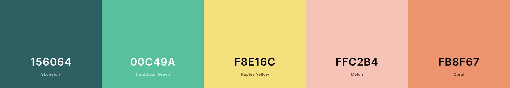
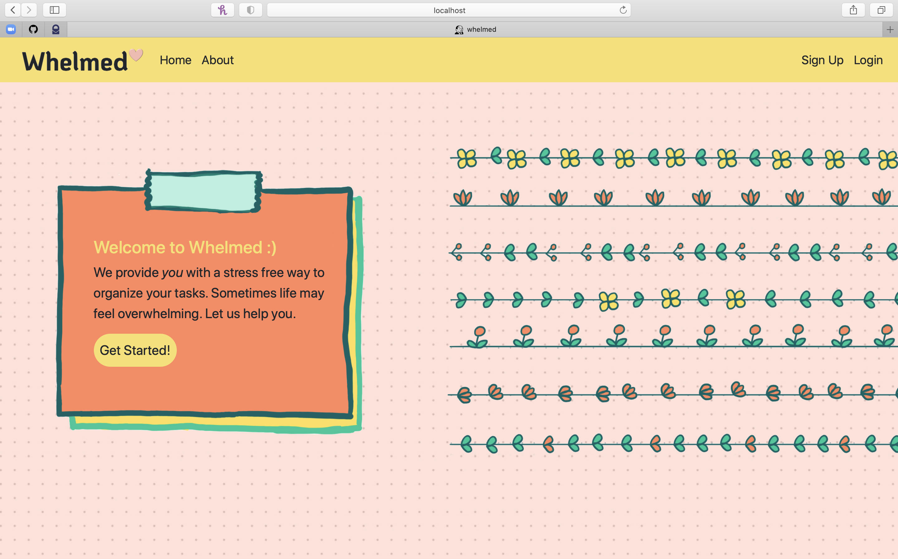
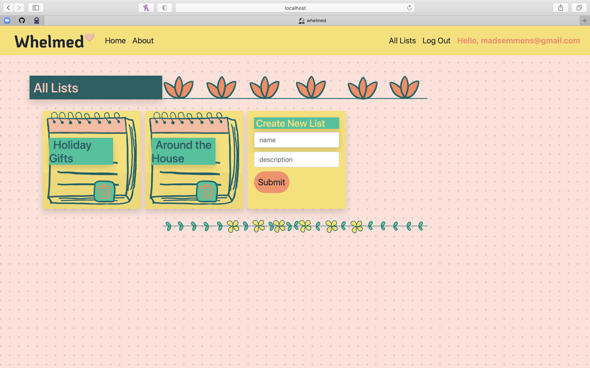
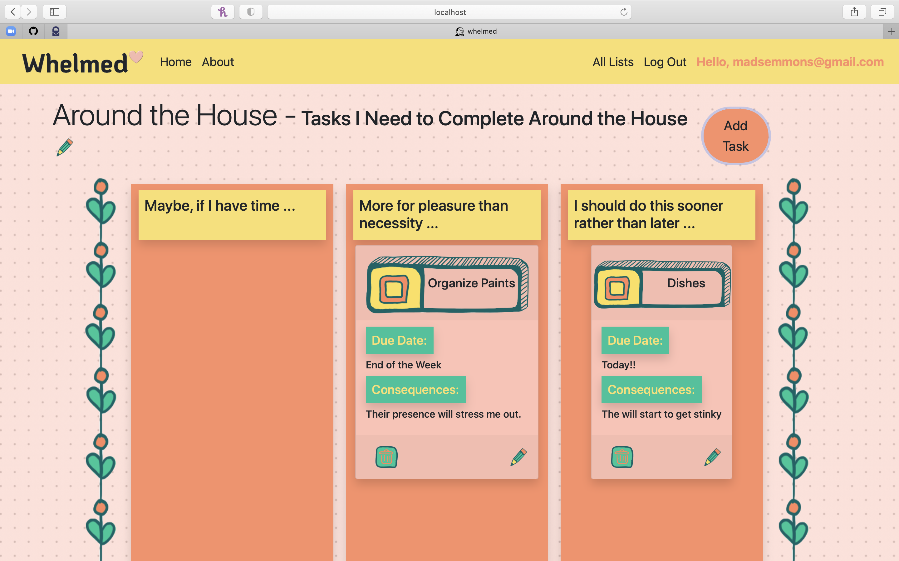

# Capstone-Frontend
## Overview & Technology Used
This is the frontend for my capstone project in the Java Immersive taught by General Assembly and hosted by Interapt
and CVS.

In the project, we were tasked with creating a web application that displayed the culmination of all the skills
we had learned during the immersive. This frontend was built using the framework Angular. It has been
deployed to Heroku and it is connected to a backend that was also deployed to heroku.  The app gives users the ability to 
create todo lists in a way that is stress free. It requires them to think about the item they are adding to their list and categorize
them by priority. 
## Planning
To see prior planning, take a look at my <a href="https://github.com/madeleinee123/Capstone-Backend#planning">repo for the backend</a>.

After completing the backend, I needed to make wireframes for the front end. I made a whole bunch and can be found in WIREFRAMES.md. I also got to pick a color palette.

After completing the backend, I needed to make wireframes for the front end. I made a whole bunch and can be found in <a href="https://github.com/madeleinee123/Capstone-Frontend/blob/main/WIREFRAMES.md#wireframes">WIREFRAMES.md</a>.

The next step again was user stories on the trello board. Here's a link to the <a href="https://trello.com/b/9CTWcxxz/frontend">frontend Trello board</a>.
Now I was ready to rumble.
## Execution
The angular app is broken into a series of components and uses routing to navigate between the different pages.  I had a tough time understanding routing but finally got the hang of it. 
I feel really confident about it after this project.  Another struggle in the project was figuring out how to connect the frontend with the backend. I had a lot of CORS errors but finally managed to
get everything connected by altering the `SecurityConfiguration` file in my backend.  One of the biggest struggles was the CSS. Everything was constantly wonky, and I was having to find 
little mistakes all the time.  I eventually started to use Bootstrap and it got so much easier. Here are some screen shots of my final product!

## In the Future
As I mentioned the CSS was really tough (but fun) for me.  Right now my app isn't very responsive so in the future I would really like to make it responsive to the screen size.  Additionally,there are some features that I wanted to impliment like hovering over a list or task to see their description as well as notifying the user when they have not successfully made a change and why it was unsuccessful.   
## Installation
1. Fork and clone the repo on to your local machine
2. Download the Angular CLI with the command `npm install -g @angular/cli`
3. Go into the file `user.service.ts `and the file `group.service.ts` and change the heroku url to be the url of your backend. 
4. cd into the root directory of the app and run the command ng serve --open
5. A window should open in your browser with the web-app running
## Links
- Backend Repo: https://github.com/madeleinee123/Capstone-Backend
- Frontend Repo: https://github.com/madeleinee123/Capstone-Frontend
- Deployed Heroku Backend: https://whelmed-backend.herokuapp.com
- Deployed Heroku Frontend: https://whelmed.herokuapp.com
## Honorable Mentions
My project wouldn't be complete without mentioning my resources. 

First, I relied heavily on <a href="https://www.w3schools.com/bootstrap4/default.asp">W3School's Bootstrap 4 tutorial</a>. That website was a blessing.

Additionally, I would like to thank my teacher's at GA Marc, Suresh, Matt, and Thiago.  They are very helpful both during 
this project and also throughout the course. Thanks!

